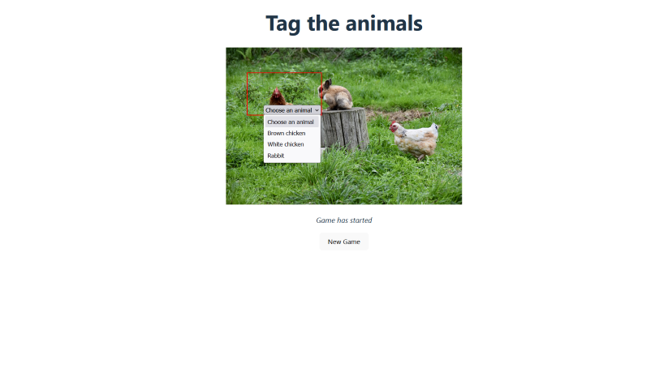

# Tag the animals

This project is build using a React frontend and backend using Express, NodeJS and MongoDB. Characters pixel positions are saved as a model and checked in the backend when a user click & selects an animal. A unique ID is created to keep track of the user's time.

## The Odin Project: Lesson Where's Waldo (a photo tagging app)

This project is build according to the specification of the [Where's Waldo lesson](https://www.theodinproject.com/lessons/nodejs-where-s-waldo-a-photo-tagging-app)

## Preview

A project that is similar to the game Where's Waldo? Click on an animal in the image and identify which animal it is from the list. Try to beat the times in the highscore list. The timer starts when you click on the image.

## Run locally

*In order to run project locally NodeJS + Git needs to installed on your system*

Follow these steps on Mac/Linux/WSL to run the project locally:

1. Open a terminal and go to a directory you want the repository to be in
2. Select Code in the Github project page and copy the SSH URL
3. git clone *SSH URL*
4. 'cd' into the repository you just cloned
5. 'cd' into phototag-backend & run 'npm install'
6. In the app.js file, replace 'require("./config/database")' with 'require("./config/databaseTest")'. This is done so that the mock database is used.
7. Run 'npm run serverStart' in phototag-backend directory
8. Open another terminal
9. 'cd' into phototag-frontend & run 'npm install'
10. Run 'npm run dev' in phototag-frontend
11. Open the link that is shown in the terminal in your browser
